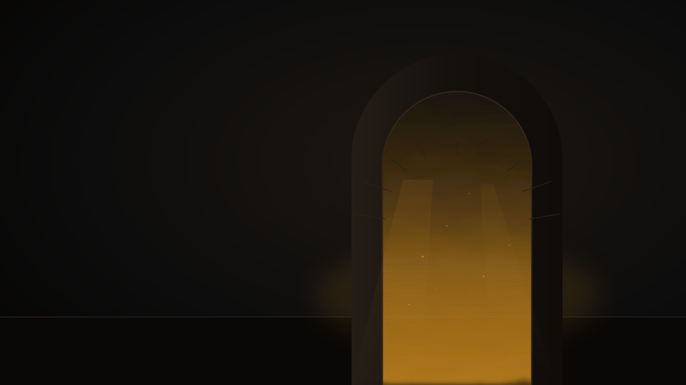
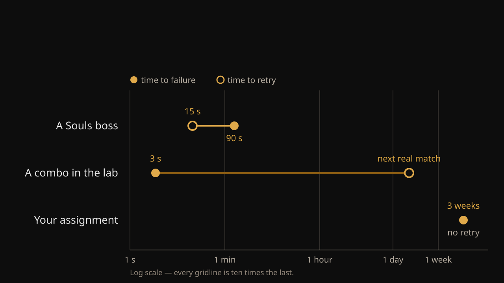
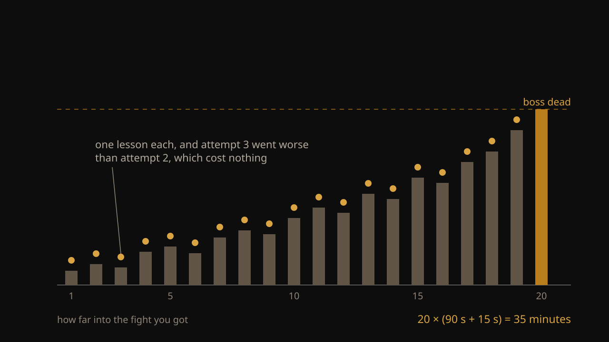
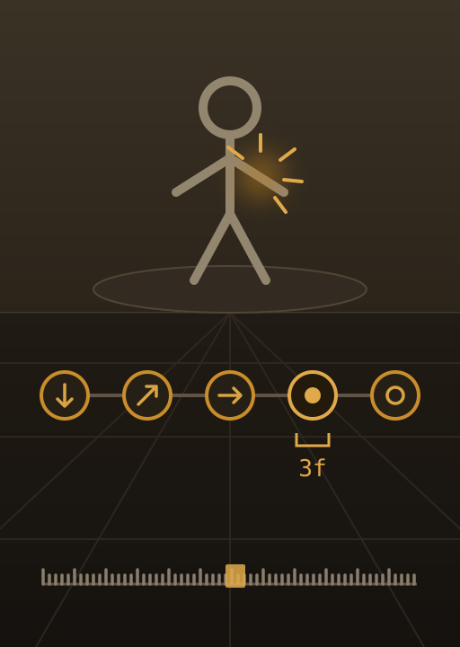
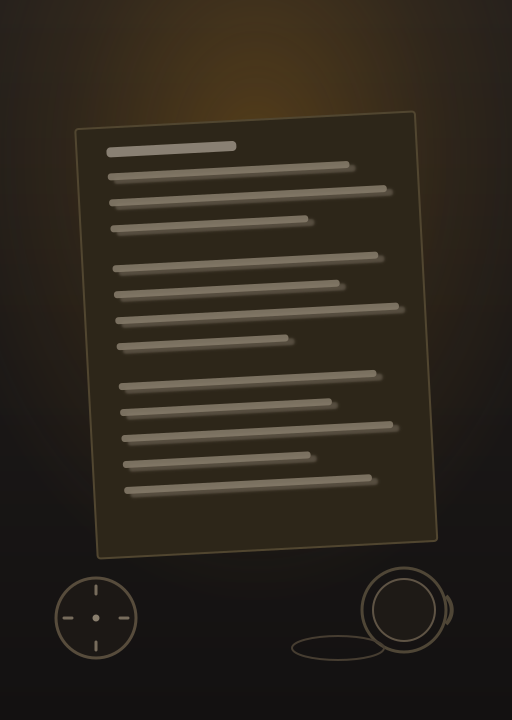
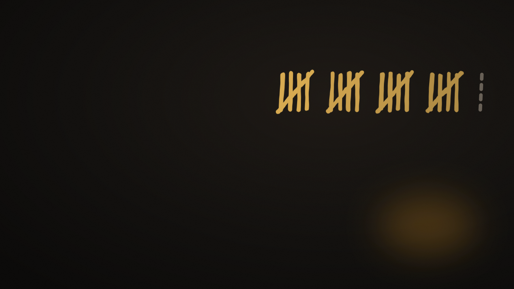

{/* _class: hero */}



# The hardest game is the one people finish

## SLOP3733 · Week 6

```notes
Ask who has played one and who has bounced off one. Both answers are useful
later. Do not give away the turn on slide 3.
```

---

## By every rule, this should not have worked

A Souls game kills you constantly. It explains almost nothing. It takes about
a hundred hours.

One boss can take you fifteen or twenty attempts before you get past it.

Nothing about that sounds like a game people finish.

---

## Here is the turn

**Because the boss is hard, you die in a minute or two.**

So you find out you were wrong after a minute or two. And you can be back in
front of it fifteen seconds later.

Being hard is not something the game overcomes. Being hard is what makes the
feedback fast.

```notes
This is the whole lecture. Say it slowly and say it twice. The usual reading
is that Souls games succeed *despite* being punishing; the argument here is
that the punishment is the delivery mechanism.
```

---

{/* _class: impact */}

# Difficulty is not fighting the feedback loop

It is producing it

---

{/* _class: hero */}


# So measure the loop

```notes
The ring has a seam. The dim arc is the attempt, the bright short arc is the
retry. That seam is what the next three slides measure.
```

---

## Two numbers you can time with a stopwatch

- **Time to failure** — you start an attempt, and you find out it did not
  work.
- **Time to retry** — from that moment until you can be trying again.

Everything has both. Reading a chapter has both. An assignment has both.

---



## The three loops, drawn to scale

```notes
Say out loud that the axis is logarithmic and every gridline is ten times the
last, or the eye reads the gaps as equal.

The middle row is the one to dwell on. Failing a combo in training mode is
nearly free, and the answer that matters is still two days away.
```

---

{/* _class: impact */}

# The cruellest one has the shortest loop

And it is cruel and short for the same reason

---

{/* _class: hero */}


# Now what happens inside those two minutes

```notes
Twenty-two grey lines and one gold one. Ask when they last finished a study
session able to say one specific thing they now knew.
```

---

## Two minutes is only long enough to remember one thing

Not five. You come out of that fight holding one observation, maybe two,
because that is all a two-minute attempt leaves you room to keep.

---

{/* _class: quote */}

> It always sweeps after the second swing.

That is the one thing. It cost you two minutes, and you can check it
immediately.

---

{/* _class: impact */}

# "If I fix just that one thing, do I get through?"

---

## You are already clicking

You did not decide to keep going. You did not talk yourself into another
attempt. You wanted to know the answer to that question, and the only way to
find out is to walk back in.

Curiosity got you to attempt twenty. Nothing had to be overcome.

---



## Twenty attempts, one thing learned each time

```notes
Point at attempts 3, 6, 9, 12, 14, 16 — each one worse than the attempt
before. That is what makes it honest, and it is why people keep going: a bad
attempt still hands you a dot.

Twenty deaths is about thirty-five minutes. That surprises people.
```

---



## Compare that with a fighting game

A fighting game asks you to love it first. You go to training mode, you grind
a combo against a dummy, you learn frame data — and you find out days later,
in a real match, whether any of it was worth the hours.

That works, but only for people who already love the game enough to do
unrewarded work.

**A Souls game asks for something everybody has.** Wanting to know what
happens if you fix one thing.

```notes
This is the slide that explains why Souls games outsell games that are far
gentler to start. Not because punishment is appealing. Because curiosity is
common and devotion is rare.
```

---

## Two things had to be true for that to work

**You could name what killed you.** The game showed you the sweep. If you
cannot name the cause, there is no one thing to take into the next attempt.

**The boss never changed.** Between attempt 4 and attempt 20 the only thing
that moved was you, so getting better was something you could feel.

---



## Neither one is true when you study

You cannot say what went wrong in the last three hours. Nothing showed you
the sweep.

And the material is not the same thing twice. Every time you come back to it
you are reading something slightly different from what you remember.

So you get the punishment without any of the things that made it bearable.

```notes
The page on the right is printed twice, out of register, and the clock has no
hands. No nameable cause, no fixed opponent, nothing measured.
```

---

{/* _class: hero */}



# This week you play

## One boss. Twenty deaths. One written line each.

---

## What to bring back

Twenty lines, one per death. Each line has to be a claim about the fight that
could turn out to be wrong.

*It always sweeps after the second swing* is a claim. Attempt twenty-one
either confirms it or it does not. *I was bad at it* is not a claim, because
no attempt settles it either way.

Bring the log to the Lab in week 7. There is nothing to do in that Lab with
an empty one.
